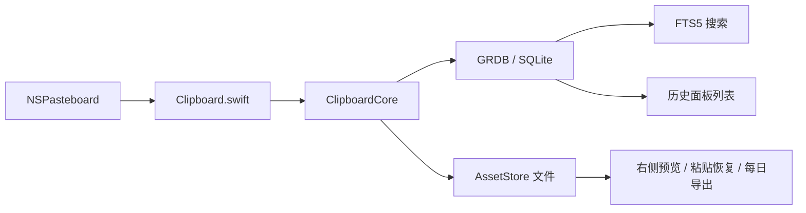

# MaccyLite

MaccyLite 是一个自用、中文优先的 macOS 快捷粘贴工具。它来自 Maccy fork，但按新项目处理：不迁移旧历史，不兼容旧设置，不保留上游发布生态。

核心目标很窄：

- 后台稳定记录剪贴板历史。
- 快捷键呼出居中历史面板。
- 快速搜索、复制、粘贴。
- 支持 Pin 常用条目。
- 文本、HTML、RTF、图片、文件 URL 都能按原始粘贴语义恢复。
- 大对象走 asset 文件，数据库只保存索引、摘要和元数据。
- 每日导出 Markdown，给后续 AI 分析使用。

## 当前边界

保留：

- 剪贴板捕获。
- 历史面板。
- 搜索。
- 复制和自动粘贴。
- Pin、删除、清空。
- 忽略 App / pasteboard type / 正则。
- 图片和文件预览。
- 每日导出。

已删除：

- OCR / Vision。
- Sparkle 更新。
- AppIntents / Shortcuts。
- 通知音效。
- App Store / 多语言发布素材。
- SwiftData 历史存储。
- GUI / XCUITest 自动验收路径。

只保留 `zh-Hans` 简体中文资源。

## 技术结构



- App 壳：Swift / AppKit / NSPanel，设置页仍使用 SwiftUI。
- 系统集成：`NSPasteboard`、Accessibility、`CGEvent`。
- Core：`ClipboardCore` SwiftPM 包。
- 存储：GRDB + SQLite + FTS5。
- 资产：`~/Library/Application Support/MaccyLite/Assets`。
- 导出：`~/Library/Application Support/MaccyLite/Exports`。

## 文档入口

| 文档 | 用途 |
| --- | --- |
| [docs/development.md](docs/development.md) | 本地构建、安装、验证、Git 交付 |
| [docs/target-architecture.md](docs/target-architecture.md) | 当前目标架构和模块边界 |
| [docs/performance-triage.md](docs/performance-triage.md) | 性能路径、风险点、排查命令 |
| [docs/productization-acceptance-matrix.md](docs/productization-acceptance-matrix.md) | 产品化验收标准 |
| [docs/manual-acceptance.md](docs/manual-acceptance.md) | 人工验收清单 |
| [docs/release-notes.md](docs/release-notes.md) | 当前内部构建说明和兼容性取舍 |
| [docs/proposal.md](docs/proposal.md) | 历史 proposal，作为设计背景 |
| [docs/storage-search-research.md](docs/storage-search-research.md) | 历史存储与搜索调研 |

## 常用命令

非 GUI 产品化验证：

```sh
scripts/validate-productization.sh
```

完整性能压测：

```sh
FULL_PERFORMANCE=1 scripts/validate-productization.sh
```

构建本地人工验收 App：

```sh
scripts/build-local-app.sh
```

生成自动证据：

```sh
scripts/write-automatic-evidence.sh
```

准备人工验收记录：

```sh
scripts/prepare-manual-acceptance-record.sh
```

人工验收清单见 `docs/manual-acceptance.md`，模板见 `docs/manual-acceptance-record.md`，实际记录写到 `dist/validation/manual-acceptance-record.md`。

检查人工验收记录：

```sh
scripts/validate-manual-acceptance-record.py
```

关闭产品化目标前的最终检查：

```sh
scripts/validate-productization-complete.sh
```

推送前确认不会误推上游 Maccy：

```sh
scripts/validate-git-delivery-safety.sh
```

## 维护命令

```sh
swift run --package-path ClipboardCore -c release clipboard-maintenance health /path/to/Clipboard.sqlite
swift run --package-path ClipboardCore -c release clipboard-maintenance reindex /path/to/Clipboard.sqlite
swift run --package-path ClipboardCore -c release clipboard-maintenance search /path/to/Clipboard.sqlite 关键词
swift run --package-path ClipboardCore -c release clipboard-maintenance assets /path/to/Clipboard.sqlite /path/to/Assets
swift run --package-path ClipboardCore -c release clipboard-maintenance cleanup-assets /path/to/Clipboard.sqlite /path/to/Assets
swift run --package-path ClipboardCore -c release clipboard-maintenance cleanup-assets /path/to/Clipboard.sqlite /path/to/Assets --apply
```

## 许可证

MIT。上游项目为 [Maccy](https://github.com/p0deje/Maccy)。
