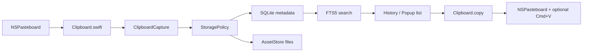

# Performance Triage

Date: 2026-06-19

## Current Baseline

The fork is now `MaccyLite`, a Core-backed quick paste clipboard manager.

The old SwiftData hot path has been removed:

- No `HistoryItem` / `HistoryItemContent` model.
- No `Storage.shared` SwiftData container.
- No old `Search` / `Sorter`.
- No Fuse fuzzy-search dependency.
- No old `MaccyTests` target.

The current hot path is:



## Verification Commands

Core tests:

```sh
cd /Users/xd/p/Maccy/ClipboardCore
swift test
```

App build:

```sh
cd /Users/xd/p/Maccy
xcodebuild \
  -project Maccy.xcodeproj \
  -scheme Maccy \
  -configuration Debug \
  -destination 'platform=macOS,arch=arm64' \
  CODE_SIGNING_ALLOWED=NO \
  build
```

Benchmarks:

```sh
cd /Users/xd/p/Maccy/ClipboardCore
swift run -c release clipboard-benchmark 100000 text --runs 20
swift run -c release clipboard-benchmark 10000 mixed --runs 20
```

Database maintenance:

```sh
cd /Users/xd/p/Maccy/ClipboardCore
swift run -c release clipboard-maintenance health /path/to/Clipboard.sqlite
swift run -c release clipboard-maintenance reindex /path/to/Clipboard.sqlite
swift run -c release clipboard-maintenance search /path/to/Clipboard.sqlite 数据库
swift run -c release clipboard-maintenance export /path/to/Clipboard.sqlite /path/to/Assets /path/to/Exports 2026-06-19
```

GUI acceptance:

- XCUITest/e2e is not part of the default validation path.
- The project does not keep a `MaccyUITests` target.
- Global shortcut, popup focus, and Accessibility paste are manual acceptance checks because they require the real macOS desktop session.

## Current Performance Controls

Storage:

- SQLite via GRDB.
- WAL enabled.
- `synchronous=NORMAL`.
- FTS5 unicode61 table for token search.
- FTS5 trigram table for CJK search.
- Indexed latest queries by copied time / pin state.

Large objects:

- Small text stays inline.
- Large text becomes an asset file with inline prefix.
- HTML/RTF can become asset-backed.
- Images are asset-backed by default.
- File URLs store URL data, not copied file contents.

Search:

- Empty query reads latest page.
- Recent bounded LIKE runs before broader FTS expansion.
- Common terms avoid full FTS + recency sort when recent results are enough.

Preview:

- List items use lightweight display text.
- Images are not decoded in the database hot path.
- Runtime App image capture is removed; old image records keep metadata only.

Runtime sampling:

- Clipboard capture logs `types`, pasteboard read time, Core insert time, and total capture time through `com.local.MaccyLite.clipboard`.
- Automatic paste checks Accessibility permission before posting Cmd+V; without permission it logs and returns instead of silently pretending to paste.
- Selecting a history item resolves the full item and asset-backed pasteboard payload on a background task; the main thread only writes prepared data to `NSPasteboard`.

Daily export:

- Runs outside copy/search/popup hot path.
- App timer exports yesterday at configured time.
- Startup catch-up handles missed days.
- Manual today/yesterday export is available from settings and runs on the export queue.
- Markdown output includes content type, byte count, file URL, image dimensions, and asset path.

Maintenance:

- `ClipboardDatabase.healthReport()` checks SQLite integrity, foreign keys, item/content counts, FTS index counts, missing FTS rows, and orphan FTS rows.
- `ClipboardDatabase.rebuildSearchIndexes()` rebuilds both unicode61 and trigram FTS5 tables from `clipboard_items.search_text`.
- `clipboard-maintenance` exposes `health`, `reindex`, `search`, `export`, and `cleanup-assets` commands for local repair/inspection.

## Latest Results

See [benchmark-report.md](/Users/xd/p/Maccy/docs/benchmark-report.md).

Text 100k:

- latest p95: `0.1437777000000002 ms`
- CJK search p95: `0.10548395 ms`
- token search p95: `0.08930239999999999 ms`

Mixed 10k:

- latest p95: `0.10635830000000021 ms`
- CJK search p95: `0.23660450000000005 ms`
- token search p95: `0.19281905 ms`
- asset bytes: `114651068`

Runtime smoke on local Debug app:

- App path: `/Users/xd/Library/Developer/Xcode/DerivedData/Maccy-gsnvaakvyfjvpndgzjgsbqmynncg/Build/Products/Debug/MaccyLite.app`.
- Runtime DB: `/Users/xd/Library/Application Support/MaccyLite/Clipboard.sqlite`.
- Captured real NSPasteboard data:
  - short text with Chinese token.
  - long UTF-8 text containing `数据库`, repeated 5000 times.
  - file URL pointing to a local temp file.
  - 1x1 PNG image.
- Verified DB shape:
  - short text inline.
  - long text asset-backed with non-empty display/search prefix.
  - file URL inline.
  - PNG old-data sample asset-backed with width/height.
- Verified maintenance:
  - health report was healthy.
  - `search 数据库` returned text rows.
  - `search maccylite-file-url-smoke` returned the file URL row.
  - manual export created `ManualExports/2026-06-19.md`.

Bug found during runtime smoke:

- Long UTF-8 text could be cut in the middle of a scalar when producing display/search prefixes.
- Fixed by truncating on `String.UTF8View.Index`, not raw `Data.prefix`.
- Covered by `captureKeepsSearchTextWhenLongUTF8TextIsTruncated`.

## Remaining Work

- Run final interactive performance pass for shortcut popup/search/paste with Accessibility permission.
