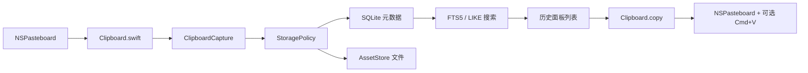

# 性能排查

更新时间：2026-06-20

## 当前基线

MaccyLite 是 Core-backed 的快捷粘贴工具。旧 SwiftData 热路径已经移除：

- 无 `HistoryItem` / `HistoryItemContent` SwiftData 模型。
- 无 `Storage.shared` SwiftData container。
- 无旧 `Search` / `Sorter`。
- 无 Fuse fuzzy-search 依赖。
- 无旧 `MaccyTests` target。

当前热路径：



## 验证命令

Core 测试：

```sh
swift test --package-path ClipboardCore
```

App 编译：

```sh
xcodebuild \
  -project Maccy.xcodeproj \
  -scheme Maccy \
  -configuration Debug \
  -destination 'platform=macOS,arch=arm64' \
  CODE_SIGNING_ALLOWED=NO \
  build
```

性能基准：

```sh
scripts/validate-performance.sh
```

完整压测：

```sh
FULL_PERFORMANCE=1 scripts/validate-productization.sh
```

维护命令：

```sh
swift run --package-path ClipboardCore -c release clipboard-maintenance health /path/to/Clipboard.sqlite
swift run --package-path ClipboardCore -c release clipboard-maintenance reindex /path/to/Clipboard.sqlite
swift run --package-path ClipboardCore -c release clipboard-maintenance search /path/to/Clipboard.sqlite 数据库
swift run --package-path ClipboardCore -c release clipboard-maintenance export /path/to/Clipboard.sqlite /path/to/Assets /path/to/Exports 2026-06-19
```

## 性能控制点

存储：

- GRDB + SQLite。
- WAL。
- `synchronous=NORMAL`。
- FTS5 unicode61 用于 token 搜索。
- FTS5 trigram 用于中文搜索。
- latest 查询按时间和 pin 状态索引。

大对象：

- 小文本 inline。
- 大文本写入 asset 文件，同时保存 inline 前缀。
- HTML / RTF 可 asset-backed。
- 图片默认 asset-backed。
- file URL 存 URL 数据，不复制文件内容。

搜索：

- 空 query 只读最新列表页。
- 近期 LIKE 先参与合并，保证用户刚复制的 substring 容易命中。
- 非短查询走 FTS5，再按规则合并去重。
- 短中文查询在近期结果不足时会做全量 LIKE 兜底，避免旧历史静默搜不到。
- 搜索只查 `search_text`，不扫完整 asset 文件。

预览：

- 列表只使用 `display_text` 和元数据。
- 文件项优先按文件语义展示；如果同时带图片 payload，图片只作为缩略图来源，不改变类型语义。
- 图片不在数据库热路径解码；右侧预览才生成受限缩略图。
- 普通文本右侧完整展示。
- 超大文本右侧只读 asset 前缀；粘贴仍读取完整 payload。

运行时采样：

- Clipboard capture 日志包含 `types`、pasteboard read、Core insert、total capture。
- 超过阈值会写 warning。
- 自动粘贴前检查 Accessibility 权限；未授权不发送 Cmd+V。
- 选择历史项时，完整 item 和 asset-backed payload 在后台准备；主线程只写已经准备好的数据到 `NSPasteboard`。

每日导出：

- 不在复制、搜索、弹窗热路径。
- 定时导出昨日内容。
- 启动时补导出漏掉的日期。
- 设置页可手动导出今天/昨天。
- Markdown 包含类型、字节数、file URL、图片尺寸和 asset 路径。

## 排查顺序

1. 面板打开慢：看 latest 查询、列表渲染、是否读了完整 asset。
2. 搜索慢：先跑 `scripts/validate-performance.sh`，再用 maintenance search 复现 query。
3. 复制时卡：看 `Clipboard capture sample`，区分 pasteboard read 和 Core insert。
4. 选中预览卡：看是否是图片缩略图、QuickLook 文件预览或超大文本 layout。
5. 粘贴慢：看 payload 是否 asset-backed，确认是读 asset 还是目标 App 接收慢。

## 最新状态

当前自动基线见 `docs/benchmark-report.md`。最终体感以 `docs/manual-acceptance.md` 的人工验收为准。
