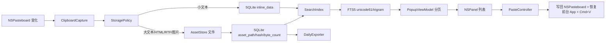

# Clipboard Lite Proposal

## 1. 总目标

做一个自用、中文优先、长期流畅的 macOS 快捷粘贴工具。

它不是增强版 Maccy，也不是 AI 助手。核心目标只有一个：

```text
复制什么都能稳定记录；
按快捷键能瞬间搜到；
选中后能可靠粘贴；
长期用不胀库、不拖慢、不崩。
```

每日剪贴板导出是附属能力，用于后续 AI 分析，不进入弹窗热路径。

## 2. 产品定位

保留 Maccy 的产品形态：

- 菜单栏后台运行。
- 全局快捷键呼出历史面板。
- 搜索、选择、粘贴。
- Pin 常用项。
- 忽略指定 App / 类型 / 正则。

但不保留 Maccy 的核心实现：

- 不兼容旧 Maccy 数据库。
- 不兼容旧 Maccy 用户设置。
- 不兼容旧 Maccy 插件、Shortcuts、更新、国际化生态。
- 不继续以 SwiftData 作为主存储。
- 不继续把完整历史对象加载进内存再展示/搜索。
- 不继续把大文本、富文本、图片直接塞进数据库热路径。

## 3. 技术路线

最终架构：

```text
Swift/AppKit 原生壳
+ ClipboardCore Swift Package
+ GRDB / SQLite
+ SQLite FTS5 unicode61 + trigram
+ 文件资产库 AssetStore
+ 后台导出任务
```

不采用 Tauri 全重写。

原因：

- macOS 剪贴板、NSPanel、菜单栏、Accessibility 粘贴、前台 App 恢复都是原生 API 场景。
- Tauri 可以做 UI 壳，但关键体验仍要桥接原生，收益不够。
- Rust/Tantivy 适合超大规模全文搜索，但个人剪贴板数据规模下 SQLite/FTS5 足够。
- 真正的问题不是 Swift 语言性能，而是当前存储、索引、加载和预览策略错误。

Rust/Tantivy 保留为未来可选插件：

- 只用于深度全文资产搜索。
- 不进入默认弹窗搜索。
- 不作为主存储。

## 4. 核心架构



模块分层：

```text
AppShell
  AppDelegate
  MenuBarController
  HotKeyController
  PopupPanelController
  PasteController
  AccessibilityController

ClipboardCore
  ClipboardCapture
  StoragePolicy
  AssetStore
  ClipboardDatabase
  SearchIndex
  DailyExporter

UI
  HistoryListView
  SearchFieldView
  PreviewPane
  Settings
```

工程边界：

- `ClipboardCore` 是正式业务核心。
- Maccy 旧代码只作为参考，不作为必须兼容的接口。
- 不保留旧 `HistoryItem` / SwiftData / 旧 `HistoryItemDecorator` 作为长期边界。
- 不允许新功能通过“伪装成旧模型”的方式接入。
- 可以直接重构、替换、删除旧模块。
- AppShell 只依赖 Core 的 list item、stored item、paste payload、search result。

## 5. 要砍掉的功能

必须砍：

- OCR / Vision。
- Sparkle 自动更新。
- App Store review prompt。
- AppIntents / Shortcuts。
- 通知音效。
- 多语言资源，只保留 `zh-Hans`。
- 图片文字识别和图片智能分析。
- 复杂富文本预览能力。
- 任何会在复制、搜索、弹窗打开时做大对象解码的功能。

暂时砍：

- 自动检查更新。
- 过度复杂的设置项。
- 复杂的 preview 类型分支。
- 不常用的菜单命令。
- 对历史全量内容的默认全文搜索。

保留但降级：

- 图片：App 运行时不再捕获；Core 仅保留旧图片 asset metadata 的读取和导出能力。
- HTML/RTF：保留原始数据用于粘贴，搜索只索引提取文本/前缀。
- 文件 URL：只记录路径和元数据，不复制文件内容。

## 6. 要优化的功能

### 6.1 复制捕获

目标：

- 复制事件不能明显卡主线程。
- 大对象不能直接进 DB BLOB 热路径。
- 同一次复制里的多 pasteboard type 要合并为一个 item。

策略：

- 小文本 inline。
- 大文本写文件，DB 存 prefix + assetPath。
- 图片不进入 App 运行时捕获路径。
- HTML/RTF 原文写文件，搜索文本单独提取。
- 忽略规则尽量先判断类型和来源，再读取重数据。

### 6.2 存储

目标：

- 明确 schema。
- 明确索引。
- 明确迁移。
- 支持 10 万条个人历史仍然流畅。

替换：

- SwiftData -> GRDB/SQLite。

表：

```text
clipboard_items
clipboard_contents
clipboard_search
clipboard_trigram
daily_exports
```

SQLite 设置：

```text
WAL
synchronous=NORMAL
foreign_keys=ON
必要索引 copied_at / source_app / pinned / content_hash
```

### 6.3 搜索

目标：

- 弹窗搜索结果在体感上瞬时返回。
- 中文短词、URL、英文 token 都能搜。
- 默认不扫完整大文件。

策略：

```text
空 query:
  latest page, copied_at desc

1-2 字 query:
  最近 N 条 bounded LIKE

中文 3 字以上:
  trigram FTS5

英文 / URL / token:
  unicode61 FTS5

深度搜索:
  单独入口，后台扫资产文件或 Tantivy 插件
```

### 6.4 弹窗 UI

目标：

- 打开面板不全量加载。
- 列表滚动只展示轻量文本。
- 搜索不阻塞输入。

策略：

- ViewModel 分页。
- 列表只拿 `displayText`、type、copiedAt、sourceApp、pin。
- preview 延迟加载。
- 长文本永远截断显示。

### 6.5 粘贴

目标：

- 选中后粘贴可靠。
- 大对象能恢复完整原始 payload。

策略：

- `PasteController` 统一写回 NSPasteboard。
- 从 SQLite 读 metadata，从 AssetStore 读完整 payload。
- 保留原 Maccy 的 Accessibility 粘贴经验，但实现边界重写。

### 6.6 每日导出

目标：

- 每天产出一个可给 AI 分析的文档。
- 不影响剪贴板工具主体验。

输出：

```text
~/Library/Application Support/MaccyLite/Exports/
  2026-06-19.md
  2026-06-20.md
```

内容：

- 时间线。
- 来源 App。
- 类型。
- 文本内容。
- 文件 URL。
- 大对象引用路径。
- 图片只导出元数据和路径，不默认 OCR。

触发：

- 每日定时。
- 手动导出。
- 支持重新生成某一天。
- App 启动时补导出最近 N 天，避免关机/睡眠错过定时点。
- 导出后可顺手清理孤儿 asset 文件。

当前调度器边界：

- 使用 App 进程内 `Timer`，不做系统级 daemon。
- App 没运行或机器睡眠时不强行唤醒。
- 启动补导出兜底，导出文件幂等覆盖。
- 默认 `00:05` 导出昨天，时间可在设置里改。

## 7. 要新增的功能

必须新增：

- GRDB/SQLite 核心库。
- 文件资产库。
- FTS5 搜索索引。
- 分页历史 API。
- 每日 Markdown 导出。
- 存储体积统计。
  - 大对象策略设置：
  - 文本 inline 阈值。
  - 图片是否记录。
  - 每日导出时间。
  - 每日导出路径。
  - 历史保留天数或最大条数。

应该新增：

- 压测命令。
- 数据库健康检查。
- 清理孤儿 asset 文件。
- 重新建立搜索索引。
- 导出失败日志。

以后再看：

- Tantivy 深度搜索插件。
- 本地 AI 摘要插件。
- 自动分类。

## 8. 测试方案

### 8.1 ClipboardCore 单元测试

覆盖：

- 数据库初始化。
- migration。
- 插入小文本。
- 插入大文本 asset。
- 插入 HTML/RTF。
- 插入图片 metadata。
- latest 分页。
- pin 排序。
- unicode61 英文/URL 搜索。
- trigram 中文搜索。
- 1-2 字短 query fallback。
- 删除 item 时 cascade contents。
- 清理 orphan assets。

### 8.2 集成测试

覆盖：

- 捕获 pasteboard item。
- 多 pasteboard type 合并。
- 忽略 App。
- 忽略 type。
- 忽略正则。
- 从 asset 恢复完整 payload。
- 每日导出。

### 8.3 性能测试

数据集：

```text
1k items
10k items
100k items
10 MB long text
100 MB mixed assets
1k image records
URL/token-heavy history
Chinese-heavy history
```

指标：

```text
popup open p95 < 80 ms
empty latest query p95 < 20 ms
search p95 < 50 ms
insert small text p95 < 20 ms
insert large text metadata p95 < 50 ms, file write excluded/async
scroll no visible jank
DB size predictable
asset cleanup deterministic
```

### 8.4 手工验收

场景：

- 从浏览器复制 URL。
- 从编辑器复制长代码。
- 从 ChatGPT/网页复制大段 Markdown。
- 从 Finder 复制文件。
- 从截图工具复制图片。
- 快捷键打开、搜索、粘贴。
- 连续复制 100 次。
- 一天后导出 Markdown。

## 9. 迁移计划

不做复杂历史迁移。

这是自用 fork，优先做干净新库：

- 新 bundle id。
- 新 Application Support 目录。
- 新 SQLite。
- 新 AssetStore。

旧 Maccy 数据最多做一次性导入工具，不作为主线。

## 10. 里程碑

### M0: 目标架构冻结

产物：

- `docs/proposal.md`
- `docs/target-architecture.md`
- `ClipboardCore` Swift Package

验收：

- `swift build` 通过。
- `swift test` 通过。

### M1: ClipboardCore 完整核心

产物：

- AssetStore。
- StoragePolicy。
- ClipboardDatabase 完整 schema。
- SearchIndex。
- DailyExporter。
- 压测 fixtures。

验收：

- 单元测试覆盖核心路径。
- 10 万条 synthetic 数据搜索达标。

### M2: AppShell 接入

产物：

- MaccyLite App 使用 ClipboardCore。
- 原 SwiftData History 路径下线。
- Popup 分页加载。
- 粘贴路径走新 PasteController。

验收：

- 日常复制/搜索/粘贴可用。
- 大文本和图片不让 DB 暴涨。

### M3: 功能裁剪完成

产物：

- 删除 SwiftData 模型依赖。
- 删除剩余无用设置。
- 删除无用资源。
- 中文资源整理。

验收：

- 工程结构干净。
- App 只保留目标功能。

### M4: 性能验收

产物：

- benchmark 命令。
- 压测报告。
- 手工验收清单。

验收：

- 10 万条历史可用。
- 弹窗打开、搜索、滚动不卡。
- 每日导出不影响主体验。

## 11. 风险

### macOS pasteboard 类型复杂

处理：

- 类型白名单。
- 大对象策略。
- 文件化原始 payload。

### Accessibility 粘贴不稳定

处理：

- 保留 Maccy 成熟逻辑作为参考。
- 单独封装 PasteController。
- 增加手工验收场景。
- 自动粘贴前显式检查权限，避免无权限时静默失败。

### 中文搜索

处理：

- unicode61 + trigram 双索引。
- 短 query fallback。
- 不承诺全文语义搜索。

### SwiftData 到 GRDB 重写成本

处理：

- 不迁就旧结构。
- ClipboardCore 先独立完成。
- AppShell 再接入。

## 12. 最终验收定义

这个项目完成的标准：

- App 是中文优先。
- 没有 OCR、更新器、Shortcuts、多语言包等旁支。
- 小复制正常记录。
- 大复制自动文件化。
- 搜索 10 万条个人历史仍然流畅。
- 粘贴能恢复原始内容。
- 每日能导出 Markdown 给 AI 分析。
- 数据库和资产目录结构可理解、可清理、可重建索引。
- 代码结构上 AppShell 和 ClipboardCore 分离。

## 13. 当前状态

已经完成：

- Fork baseline。
- 改名 `MaccyLite`。
- 单中文资源方向。
- 删除 OCR / Sparkle / App Store review / AppIntents / 通知音效。
- 新增 `ClipboardCore` Swift Package。
- `ClipboardCore` 已接 GRDB。
- 已实现最小 SQLite schema、insert、latest、search。
- 已实现 `AssetStore`。
- 已实现 `StoragePolicy`。
- 已实现 `DailyExporter`。
- `DailyExporter` Markdown 已包含：
  - content type。
  - byte count。
  - file URL。
  - 图片尺寸。
  - asset path。
- 已实现 orphan asset 清理。
- 已实现 pin / delete 核心 API。
- 已实现 `ClipboardCapture` 构造层：
  - 多 pasteboard type 合并。
  - 类型优先级。
  - legacy text type 归一化。
  - HTML 文本抽取。
  - RTF 降级记录但不默认索引正文。
  - 旧图片 asset metadata：
    - ImageIO 读取图片宽高。
    - DB 记录 `image_width` / `image_height`。
- 已新增 `clipboard-benchmark` 压测入口。
- 已完成 10 万条 release benchmark，20-run 采样：
  - insert: `33908.846 ms`
  - latest p95: `0.1437777000000002 ms`
  - 中文 common query p95: `0.10548395 ms`
  - token common query p95: `0.08930239999999999 ms`
- 已扩展 `clipboard-benchmark`：
  - `text` 模式：纯文本 100k。
  - `mixed` 模式：短文本、长文本、HTML、RTF、文件 URL、PNG 旧数据样本。
- 已完成 mixed 10k release benchmark，20-run 采样：
  - insert: `7887.974958 ms`
  - latest p95: `0.10635830000000021 ms`
  - 中文 common query p95: `0.23660450000000005 ms`
  - token common query p95: `0.19281905 ms`
  - asset bytes: `114651068`
- 已优化 common query 搜索路径：
  - 先查最近 5000 条 bounded LIKE。
  - 命中足够则直接返回。
  - 不足时再扩展到 FTS5。
- AppShell 接入：
  - Xcode App target 已接入本地 `ClipboardCore` package。
  - App target 已能解析并链接 GRDB/ClipboardCore。
  - 新增 `ClipboardCoreStore` 作为 App 侧 Core 适配器。
  - 新增 `ClipboardHistoryStore` 作为 Core-backed history 边界。
  - `ClipboardCoreStore` 已改为通过 `ClipboardHistoryStore` 执行 insert/latest/search/item/pin/delete。
  - `ClipboardCoreStore` 已暴露 latest/search/item/pin/delete。
  - `ClipboardCoreStore` 已支持 inline/file asset payload 还原。
  - 粘贴 payload 选择与 asset 读取规则已下沉到 `ClipboardPasteboardPayloadResolver`。
  - `ClipboardCoreStore` 已暴露每日导出和 orphan asset 清理入口。
  - `Clipboard.copy(ClipboardStoredItem)` 已支持 Core item 写回 NSPasteboard。
  - 新增 `PasteController`，负责自动 Cmd+V 系统事件发送。
  - Core 粘贴路径保留 file URL `writeObjects` 行为。
  - Core 粘贴路径支持去格式化时保留纯文本和 file URL。
  - 自动 Cmd+V 前会检查 Accessibility 权限。
  - 无 Accessibility 权限时只复制、不模拟粘贴，并触发系统授权提示。
  - `Clipboard.swift` 捕获路径已切到 `ClipboardCore`，不再构造 SwiftData `HistoryItem`。
  - `History` 列表、搜索、选择、删除、pin 已切到 Core-backed `ClipboardStoredItem`。
  - `HistoryItem` / `HistoryItemContent` / `Storage` / `Search` / `Sorter` 旧文件已删除。
  - `History.xcdatamodeld` / `Storage.xcdatamodeld` 旧数据模型文件已删除。
  - SwiftData container 注入已删除。
  - Fuse fuzzy-search 依赖已删除，搜索由 SQLite/FTS5 接管。
  - Pin 设置已降级为 Core pinned item 管理，旧版别名/内容编辑已删除。
  - 新增 `DailyExportScheduler`：
    - 默认关闭，需要用户显式启用。
    - 可配置导出小时和分钟。
    - 启用后默认每天 `00:05` 导出昨天。
    - 启动时在后台补导出最近 N 天，默认 7 天。
    - 可配置导出后清理 orphan assets。
    - 设置页支持手动导出今天/昨天。
    - 导出目录固定为 `Application Support/MaccyLite/Exports`，避免 sandbox 外部目录和 security-scoped bookmark 复杂度。
- `swift build` 通过。
- `swift test` 通过。
- `xcodebuild` Debug App build 通过。
- 已补充短中文超过最近窗口的搜索测试。
- 已补充多文件 URL 捕获测试。
- 已补充静态 non-GUI 验收脚本 `scripts/verify-non-gui-validation.py`。
- 已删除旧 `MaccyTests` target 和旧 `MaccyTests` 文件夹：
  - 旧测试依赖已删除的 SwiftData `HistoryItem` / `Search` / `Sorter`。
- `Maccy.xctestplan` 当前不包含 UI/e2e test target。
- `MaccyUITests` target 已删除，不作为默认验收路径。
- 全局快捷键、popup 焦点、Accessibility 自动粘贴只做人工验收，不放入自动测试。
- 本地启动和 Accessibility 粘贴只作为人工验收，不进入自动验证路径。
- 已新增 `docs/development.md`：
  - 说明 Xcode Run、本地 ad-hoc 签名、quarantine/Gatekeeper 处理。
  - 明确 `CODE_SIGNING_ALLOWED=NO` build 只用于编译验证，不适合作为双击运行包。
- 已清理残留 UI/设置：
  - 面板标题改为 `MaccyLite`。
  - Accessibility 权限提示改为 `MaccyLite`。
  - About 面板只保留当前名称和上游 Maccy 链接。
  - 删除未使用的检查更新字符串。
  - 删除未使用的旧搜索模式字符串。
  - 删除未使用的 App Store review Defaults key。
- 已新增数据库维护能力：
  - `ClipboardDatabase.healthReport()`。
  - `ClipboardDatabase.rebuildSearchIndexes()`。
  - `clipboard-maintenance health <sqlite-path>`。
  - `clipboard-maintenance reindex <sqlite-path>`。
  - `clipboard-maintenance search <sqlite-path> <query>`。
  - `clipboard-maintenance export <sqlite-path> <asset-root> <export-dir> <yyyy-mm-dd>`。
- 已新增 `DailyExportSchedulePolicy`：
  - 归一化每日导出小时/分钟。
  - 归一化启动补导出天数，限制在 `0...30`。
  - 计算下一次导出触发时间。
  - 计算启动补导出的日期列表。
  - `DailyExportScheduler` 已改为调用该 Core 策略。
- 已新增运行时性能采样：
  - 剪贴板捕获记录 pasteboard read / Core insert / total 耗时。
  - 日志 label：`com.local.MaccyLite.clipboard`。
- 已修复真实运行态暴露的长 UTF-8 文本截断问题：
  - 旧逻辑按 `Data.prefix` 截断，可能切断中文 scalar，导致 `display_text` / `search_text` 为空。
  - 现改为按 `String.UTF8View.Index` 截断。
  - 已新增 `captureKeepsSearchTextWhenLongUTF8TextIsTruncated()` 覆盖。
- 已完成真实 App 运行态 smoke：
  - Debug `MaccyLite.app` 去 quarantine、ad-hoc 签名后启动成功。
  - 真实 NSPasteboard 捕获短文本、长 UTF-8 文本、file URL。
  - 长文本自动 asset 化，DB 保留显示前缀和搜索文本。
  - App 运行时图片捕获入口已移除；旧 PNG 数据仍可通过 Core 读取宽高和导出 metadata。
  - 新 Application Support 目录使用 `Clipboard.sqlite` / `Assets` / `Exports`；不在启动路径做旧库迁移或删除。
  - `clipboard-maintenance health` 检查健康。
  - `clipboard-maintenance search` 可搜到中文长文本和 file URL token。
  - `clipboard-maintenance export` 可生成指定日期 Markdown。
- 当前 `ClipboardCore` 测试覆盖：
  - 插入 / latest / 中文搜索 / 英文 token 搜索
  - 大文本 asset 化和 inline prefix
  - 每日 Markdown 导出
  - file URL / 图片 metadata Markdown 导出
  - orphan asset 清理
  - pin 排序
  - 删除 item 并清理 FTS 索引
  - 多类型捕获
  - HTML / RTF 捕获策略
  - 图片尺寸读取
  - 数据库健康检查
  - unicode61/trigram 搜索索引重建
  - pasteboard payload 还原：
    - inline payload。
    - asset payload。
  - 去格式化时仅保留纯文本和文件 URL。
  - 缺失 asset 时抛错。
  - 每日导出调度策略：
    - 未到点时当天触发。
    - 已过点时次日触发。
    - 配置越界时 clamp。
    - catch-up 天数上限。
  - 长 UTF-8 文本截断后仍保留搜索文本。
  - Core-backed History 边界：
    - load/latest。
    - search。
    - selected item lookup。
    - delete。
    - pin 排序。
    - trim unpinned 时保留 pinned。

下一步：

- 做签名/交互环境下的最终手工验收：
  - 快捷键打开面板、搜索、选择、粘贴。
  - 设置页手动导出今天/昨天。
  - 查看运行时 capture 采样日志。
