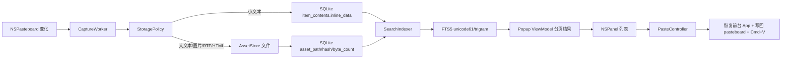
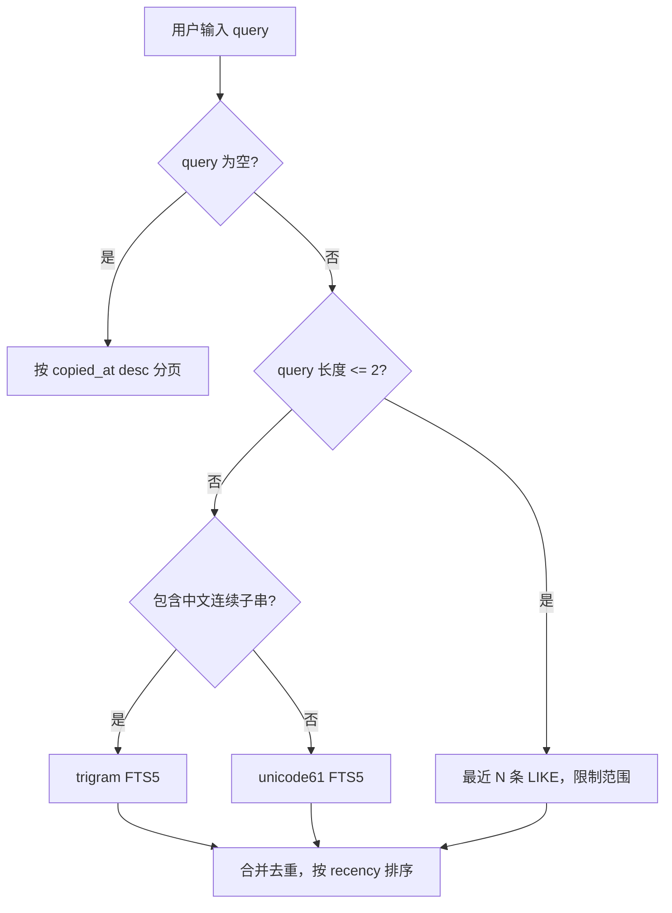

# 目标架构

目标不是“优化 Maccy”，而是做一个自用、中文优先、长期流畅的 macOS 快捷粘贴工具。

## 结论

不采用 Tauri 全重写。

采用：

```text
Swift/AppKit 原生壳
+ GRDB/SQLite 核心存储
+ 文件资产库
+ FTS5 混合搜索
+ 后台每日导出
```

Rust/Tantivy 不作为主架构。它只保留为以后“深度全文搜索插件”的候选项。

原因：

- 剪贴板、NSPanel、Accessibility 粘贴、前台 App 恢复都是 macOS 原生 API 场景。
- Tauri 能做全局快捷键、托盘、剪贴板读写，但核心体验仍要回到原生桥接。
- 这个产品的数据规模是个人级，不是千万文档搜索服务。
- SQLite/FTS5 足够把 10 万级历史做到毫秒级响应。
- SwiftData 不适合当核心库，因为它隐藏查询、迁移、索引和分页控制。

## 产品边界

保留：

- 监听剪贴板
- 快捷键呼出
- 搜索
- 快速粘贴
- Pin
- 忽略 App / 类型 / 正则
- 大对象文件化
- 每日导出给 AI 分析

删除：

- OCR / Vision
- 多语言资源，只保留 `zh-Hans`
- Sparkle 更新
- App Store review
- AppIntents / Shortcuts
- 通知音效
- 复杂图片智能分析

## 数据流



## 模块

```text
AppShell
  MenuBarController
  HotKeyController
  PopupPanelController
  PasteController       // 发送自动 Cmd+V；进入系统事件前检查 Accessibility 权限

ClipboardCore
  ClipboardCapture
  StoragePolicy
  AssetStore
  ClipboardDatabase
  SearchIndex
  DailyExporter

UI
  HistoryList
  SearchBox
  PreviewPane
  Settings
```

## 存储设计

SQLite 表：

```text
clipboard_items
  id
  copied_at
  source_app
  primary_type
  display_text
  search_text
  is_pinned
  copy_count

clipboard_contents
  id
  item_id
  pasteboard_type
  byte_count
  inline_data
  asset_path
  content_hash

clipboard_search
  item_id
  text

clipboard_trigram
  item_id
  text
```

文件资产：

```text
~/Library/Application Support/MaccyLite/Assets/
  2026/06/19/
    sha256.txt
    sha256.html
    sha256.rtf
    sha256.png
```

## 搜索策略



## 性能原则

- 弹窗打开不加载全量历史。
- 列表只读 `display_text` 和元数据。
- 预览才读资产文件。
- 粘贴才读完整 payload。
- 搜索默认不扫完整资产文件。
- 每日导出跑后台任务，不占用弹窗热路径。

## 当前执行方向

1. 新建 `ClipboardCore`，用 GRDB 替代 SwiftData。
2. 把 Maccy 现有 UI 当外壳参考，不继续依赖它的 SwiftData 模型。
3. 先跑通核心库：建库、插入、搜索、分页、导出。
4. 再把 AppShell 接到新核心库。
