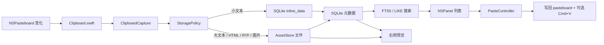
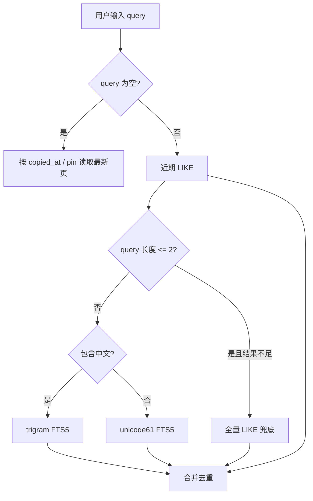

# 目标架构

MaccyLite 的目标不是继续“优化原 Maccy”，而是做一个自用、中文优先、长期流畅的 macOS 快捷粘贴工具。

## 架构结论

不采用 Tauri 全重写。

当前采用：

```text
Swift / AppKit 原生壳
+ GRDB / SQLite 核心存储
+ 文件资产库
+ FTS5 + LIKE 混合搜索
+ 后台每日导出
```

Rust / Tantivy 不作为主架构，只保留为以后“深度全文搜索插件”的候选项。

原因：

- 剪贴板、NSPanel、Accessibility 粘贴、前台 App 恢复都是 macOS 原生 API 场景。
- Tauri 能做托盘、全局快捷键、剪贴板读写，但核心体验仍要回到原生桥接。
- 个人级剪贴板历史不是千万文档搜索服务。
- SQLite / FTS5 足够支撑 10 万级历史的毫秒级查询。
- SwiftData 不适合当核心库，因为它隐藏查询、迁移、索引和分页控制。

## 产品边界

保留：

- 监听剪贴板。
- 快捷键呼出。
- 搜索。
- 快速粘贴。
- Pin。
- 忽略 App / 类型 / 正则。
- 文本、HTML、RTF、图片、file URL。
- 大对象文件化。
- 每日导出给 AI 分析。

删除：

- OCR / Vision。
- 多语言资源，只保留 `zh-Hans`。
- Sparkle 更新。
- App Store review 相关路径。
- AppIntents / Shortcuts。
- 通知音效。
- 复杂图片智能分析。

## 数据流



## 模块边界

```text
AppShell
  AppDelegate
  Clipboard.swift
  AppKitHistoryPanel
  PasteController
  DailyExportScheduler
  Settings

ClipboardCore
  ClipboardCapture
  ClipboardPasteboardCaptureRules
  StoragePolicy
  AssetStore
  ClipboardDatabase
  ClipboardHistoryStore
  ClipboardPasteboardPayloadResolver
  DailyExporter
```

原则：

- AppShell 负责 macOS 系统集成和 UI。
- ClipboardCore 负责可测试的业务逻辑。
- 自动测试尽量落在 ClipboardCore。
- 真实桌面行为只走人工验收。

## 存储设计

SQLite 主表：

```text
clipboard_items
  id
  copied_at
  source_app
  primary_type
  display_text
  search_text
  content_fingerprint
  has_image
  is_pinned
  copy_count

clipboard_contents
  id
  item_id
  pasteboard_type
  byte_count
  inline_data
  asset_path
  content_hash
  image_width
  image_height

clipboard_search
  item_id
  text

clipboard_trigram
  item_id
  text

daily_exports
  day
  path
  item_count
  exported_at
```

文件资产：

```text
~/Library/Application Support/MaccyLite/Assets/
  2026/06/19/
    sha256.txt
    sha256.html
    sha256.rtf
    sha256.png
```

## 搜索策略



搜索目标是“可预期优先于极限省 CPU”：

- 短中文词不能静默搜不到旧历史。
- 近期 substring 要优先参与合并。
- FTS 用于快速扩大结果集。
- UI 只拿有限结果，不持有全量历史。

## 预览策略

- 列表只展示一行摘要和图标。
- 右侧详情才读取更多内容。
- 普通文本可以完整展示。
- 超大文本只读前缀预览，粘贴仍恢复完整文本。
- 图片生成受限缩略图。
- 文件项展示文件语义，支持多文件路径列表和 QuickLook 缩略图。

## 性能原则

- 弹窗打开不加载全量历史。
- 列表不读完整 asset。
- 搜索不扫完整 asset。
- 预览按选中项懒加载。
- 粘贴才读取完整 payload。
- 每日导出在后台队列运行，不进入弹窗热路径。

## 当前执行方向

1. 保持 AppShell 足够薄，只做 macOS 集成和 UI。
2. 保持 ClipboardCore 可测试，核心行为优先写非 GUI 测试。
3. 性能问题先区分 pasteboard 读取、SQLite 查询、asset IO、UI layout。
4. 新功能优先看是否会进入弹窗热路径；会进入就必须有上限、分页或懒加载。
